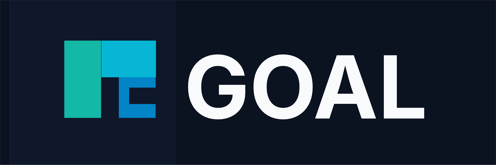

<div align="center">
  

  <br /><br />

  <p><strong>Goal-Oriented Adaptive Lifecycle</strong></p>

  <p>An open agile framework that replaces rigid sprints and Kanban chaos with<br />goal-driven cycles, flow metrics, and continuous delivery for modern software teams.</p>

  <p>
    
    
    
    
  </p>
</div>

---

## What is GOAL?

**GOAL** (Goal-Oriented Adaptive Lifecycle) is an agile methodology designed for software teams that found Scrum too rigid and Kanban too unstructured.

Instead of committing to sprint task lists, teams commit to **outcomes**. Cycles close when goals are achieved — not when a calendar says so. Performance is measured with real flow data, not abstract story points.

```
Goals over backlogs    ·    Flow over velocity    ·    Data over estimates
Delivery over activity    ·    Adaptation over commitment
```

---

## Core differentiators

| | Scrum | Kanban | **GOAL** |
|--|-------|--------|----------|
| Cycle end trigger | Calendar | — | **Goals completed** |
| Scope during cycle | Fixed | Open | **Tasks flexible, goals fixed** |
| Performance metric | Velocity | Throughput | **Flow Efficiency + CAI** |
| Interrupt handling | Sprint break | Any time | **P1 / P2 / P3 protocol** |
| Value measurement | Not defined | Not defined | **3-Layer Value Framework** |
| Technical debt | Usually ignored | Ad hoc | **10–20% allocation, first-class** |
| Estimation | Story points | None | **S / M / L sizing** |

---

## Documentation site

This repo contains the full documentation site built with **Docusaurus**, supporting **English** and **Spanish**.

**Run locally:**

```bash
bun install
bun start
```

**Build for production:**

```bash
bun run build
```

---

## What's covered

- **Core Framework** — Roles, Goal Cycle, Flow Board, WIP Limits, Definition of Done
- **Events** — Smart Planning, Daily Flow Sync, Backlog Grooming, Goal Review, Retrospective
- **Protocols** — Interrupt Management (P1/P2/P3), Blocked Task Protocol, Backlog Management
- **Metrics** — Flow Efficiency, Cycle Time, Block Rate, Cycle Accuracy Index
- **Modules** — Goal Writing, Developer Experience, Stakeholder Management, Quality Management, Capacity Planning, Risk Management, Remote & Async, OKR Integration
- **Scaling** — Multi-team model, Program Board, Dependency Management
- **Guides** — Board Templates, Workflow Diagrams (Mermaid), Tooling Integration (Jira, Linear, Trello, Notion)
- **Certification** — Practitioner, Flow Master Certified, Program Lead
- **Adoption** — FAQ (46 questions), Pilot Program Guide (3-cycle structure)

---

## Project structure

```
goal-docs/
├── docs/                  # English documentation (~50 pages)
├── i18n/es/               # Spanish translations
├── src/pages/             # Custom homepage
├── src/css/custom.css     # Brand CSS tokens
├── static/img/            # Logo assets
├── static/_redirects      # Netlify routing
├── docusaurus.config.ts   # Site config (i18n, navbar, mermaid)
└── sidebars.ts            # Navigation structure
```

---

## Deploy to Netlify

```bash
bun run build
# Drag the build/ folder to Netlify's deploy drop zone
```

The `static/_redirects` file is automatically included in the build and handles SPA routing for both locales.

---

## Contributing

GOAL is at **v0.2** — actively being developed and not yet validated by a real team.
Feedback, corrections, and pilot reports are welcome via [Issues](https://github.com/UBF21/GOAL-Agile-docs/issues).

---

## Author

**Felipe Montenegro**
Goal-Oriented Adaptive Lifecycle — *Adaptive system built from modular decisions*

---

<div align="center">
  <sub>Built with <a href="https://docusaurus.io">Docusaurus</a> · Powered by flow, not velocity.</sub>
</div>
