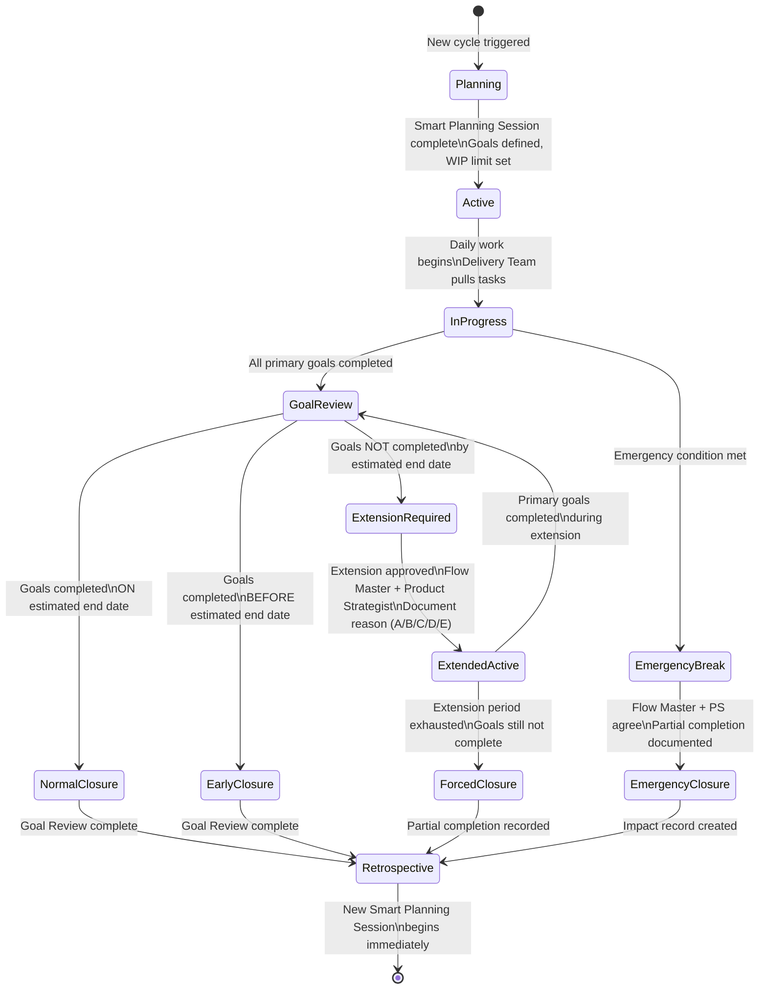
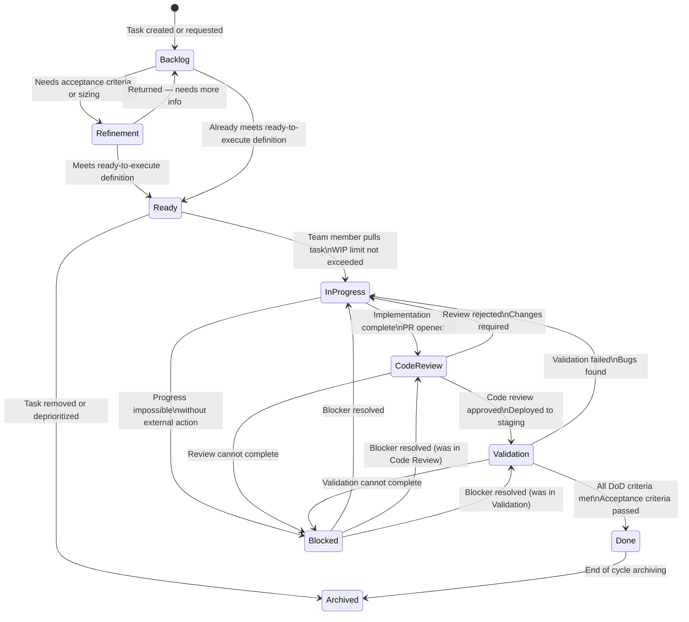
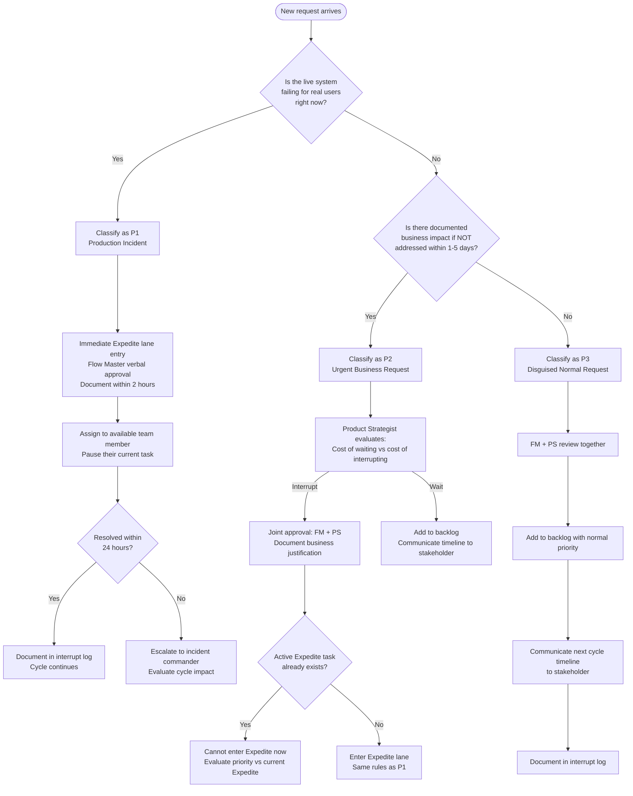
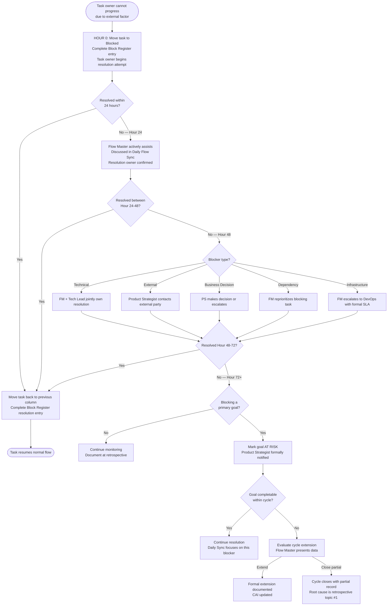
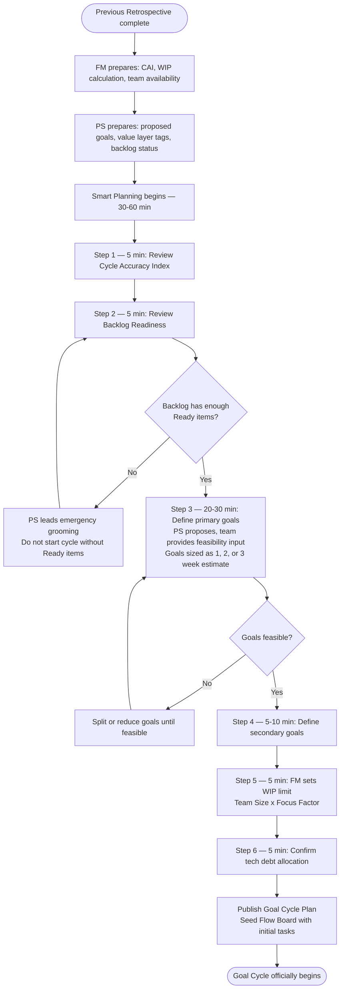
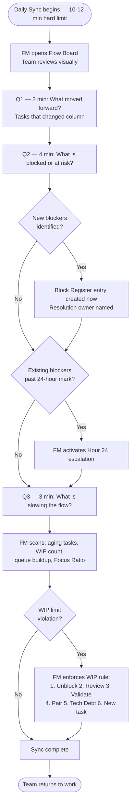
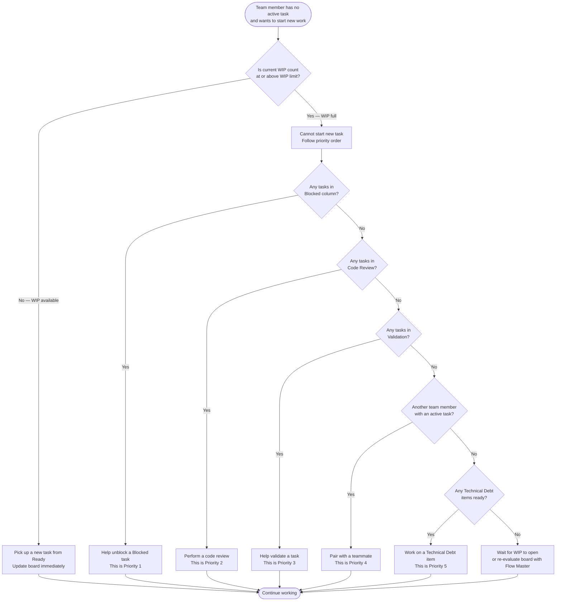
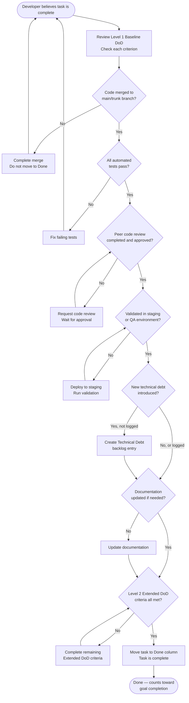
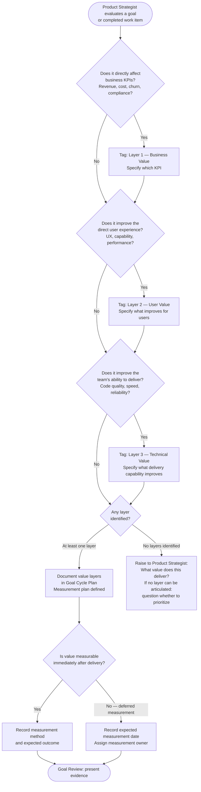

# GOAL Workflow Diagrams

All diagrams are in Mermaid format and render natively in Docusaurus.

---

## 1. Goal Cycle Lifecycle Diagram

This diagram shows the complete state machine of a GOAL Goal Cycle, from initiation through all possible closure paths.

---

## 2. Task State Machine

All possible states a single task can be in within GOAL, and the valid transitions between them.

---

## 3. Interrupt Management Protocol Flowchart

Complete decision process for handling any incoming request not in the backlog.

---

## 4. Blocked Task Escalation Flowchart

Hour-by-hour decision tree for managing a blocked task from identification through resolution.

---

## 5. Smart Planning Session Process Flow

---

## 6. Daily Flow Sync Process Flow

---

## 7. WIP Limit Enforcement Decision Flow

---

## 8. Definition of Done Validation Flow

---

## 9. Value Framework Classification Flow

---

*GOAL Workflow Diagrams v1.0 | Framework: GOAL v0.2 | Author: Felipe Montenegro*
