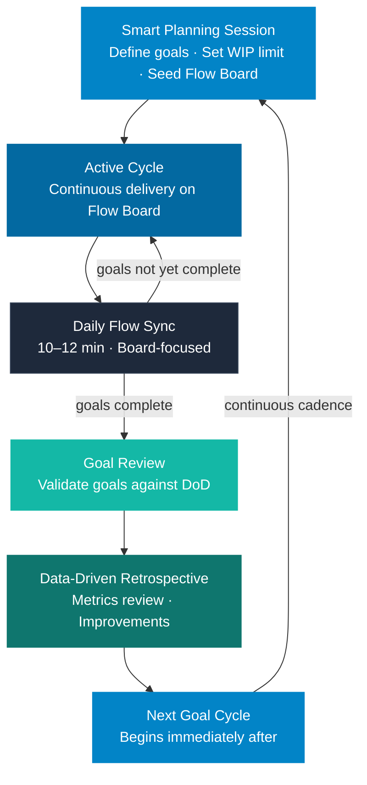

# The Goal Cycle

The Goal Cycle is GOAL's replacement for the Scrum Sprint. It is a time-bounded work period focused on achieving defined outcomes.



---

## Key Distinction from Scrum Sprint

| Dimension | Scrum Sprint | GOAL Goal Cycle |
|-----------|-------------|-----------------|
| What is fixed | Time AND scope | Time estimate AND goals |
| What is flexible | Nothing | Tasks (path to the goal) |
| What triggers end | Calendar | Goals completed |
| What happens if goals finish early | Sprint continues until calendar | Cycle closes early |
| What happens if goals need more time | Sprint fails or scope cuts | Cycle extends with documentation |

The fundamental difference: in GOAL, the goal is the commitment, not the task list.

---

## Termination Model

### Normal Closure — Goals Completed on Time

The cycle closes when all primary goals are completed and validated against the Definition of Done. If this happens before the estimated end date, the cycle closes early and a new cycle begins.

### Early Closure — Goals Completed Ahead of Schedule

If all primary goals are completed before the estimated end date, the cycle closes immediately. The team does not fill remaining time with arbitrary work. A new Smart Planning Session is called.

**Why this matters:** The goal was the commitment, not the time block. If goals are achieved, the cycle's purpose is fulfilled. Teams should not manufacture work to fill a calendar slot.

### Extended Closure — Goals Require More Time

If primary goals are not completed by the estimated end date, the cycle extends. The extension is formal and documented:

```
Extension Record (required fields):
  Original end date:      [date]
  Extension approved by:  Flow Master + Product Strategist
  Additional days:        [number]
  Extension reason:       [one of the categories below]
  Cycle Accuracy Index:   updated

Extension reason categories:
  A — External blocker (third party, another team, infrastructure)
  B — Scope underestimation (goals were larger than anticipated)
  C — Unexpected technical complexity
  D — Unplanned interruptions absorbed into the cycle
  E — Team capacity reduction (illness, departure)
```

### Maximum Extension Rule

A cycle can only be extended **once**. If goals still cannot be completed after one extension:
- The cycle closes with a partial completion record
- Remaining goals are re-evaluated for the next cycle
- Repeated extensions in the same team are a signal for retrospective investigation

---

## Goal Stability Rule

Once a Goal Cycle is active, primary goals are **locked**.

- The Product Strategist cannot change, replace, or add primary goals during an active cycle
- If a new business priority emerges that is more important than the current goals, the Emergency Cycle Protocol applies
- Secondary goals can be deprioritized during the cycle if capacity is constrained

### Why Goals Must Be Stable

Changing goals mid-cycle is the primary source of Scrum sprint failures. It creates:
- Confusion about what success means
- Destruction of planning coherence
- Demoralization of teams who feel their work is constantly being undone

GOAL protects the team's ability to finish what they started.

### Emergency Cycle Protocol

A Goal Cycle can be formally broken early in these specific cases:

**Case 1 — Full emergency:** The nature of the business has changed so fundamentally that current goals are no longer relevant. (Example: a major competitor ships a feature that makes current goals irrelevant.)

- Product Strategist proposes early closure
- Flow Master confirms flow impact
- Cycle closes with partial completion record
- Emergency Smart Planning Session held within 24 hours

**Case 2 — Accumulated P1 incidents:** P1 incidents have consumed more than 50% of the cycle's team capacity and primary goals cannot be completed in remaining time.

- Flow Master presents data showing capacity impact
- Product Strategist confirms goals cannot be reached
- Cycle closes with partial completion + interrupt impact record

**Case 3 — External blocker that resolves all goals:** A third-party dependency is officially cancelled, making all cycle goals moot.

- Flow Master and Product Strategist agree on closure
- All completed goals are documented
- New Smart Planning Session called

---

## Scope Flexibility Rule

Within a cycle, the tasks used to achieve a goal are **completely flexible**.

> A task can be added, removed, or changed at any time during a cycle, as long as the change serves the current primary goals and does not introduce new scope beyond them.

### What Is Allowed

- Replacing a manually implemented feature with a library that achieves the same goal faster
- Splitting a Large task into three Small tasks mid-cycle
- Removing a task that turns out to be unnecessary for the goal
- Adding a task discovered during implementation that is required to complete the goal

### What Is Not Allowed

- Adding a task that serves a goal not in the current cycle
- Replacing a goal with a different goal mid-cycle
- Expanding the scope of a goal without a formal change record

---

## Typical Cycle Structure

```
Week 1, Day 1:   Smart Planning Session
                 Goals defined, initial tasks identified, WIP limits set

Days 1–N:        Continuous delivery
                 Daily Flow Sync each day
                 Backlog Grooming Session mid-cycle (if cycle > 1 week)

Final Day:       Goal Review
                 All primary goals validated against DoD

Day after close: Data-Driven Retrospective
                 Flow metrics reviewed, improvements identified

Day after retro: New Smart Planning Session begins
```

**No gap between cycles.** The next cycle begins immediately after the retrospective. Continuous cadence is how GOAL maintains flow momentum.

---

## Cycle Duration

Goal Cycles are sized at 1–3 weeks based on the complexity of the primary goals:

| Duration | Best for |
|----------|----------|
| 1 week | Clear, bounded goals; experienced GOAL teams; high-urgency environments |
| 2 weeks | Standard for most teams; allows meaningful work without excessive planning overhead |
| 3 weeks | Complex goals with significant dependencies; newer teams needing more execution time |

**The team estimates cycle duration at Smart Planning.** The Cycle Accuracy Index tracks whether these estimates are improving over time.

---

## The Goal Cycle in 10 Steps

1. **Complete the previous cycle** — run Goal Review and Data-Driven Retrospective before starting a new cycle
2. **Confirm backlog readiness** — at least two cycles of ready-to-execute items before Smart Planning
3. **Run Smart Planning Session** — define goals, set WIP limit, confirm tech debt allocation
4. **Publish the Goal Cycle Plan** — immediately after Smart Planning; primary goals are now locked
5. **Seed the Flow Board** — place initial tasks in Ready (not the full list — just enough to begin)
6. **Run Daily Flow Sync every working day** — 10–12 minutes, board-focused
7. **Manage blocked tasks immediately** — Block Register entry within the hour
8. **Handle interruptions using the protocol** — P1/P2/P3 classification before any action
9. **Close the cycle when goals are completed** — calendar is irrelevant; goals drive closure
10. **Repeat from Step 1** — continuous cadence, no gap between cycles

---

*GOAL Agile Methodology v0.2 | Author: Felipe Montenegro*
