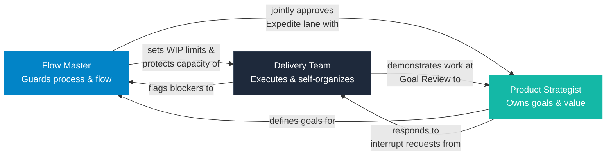

# Roles

GOAL defines three primary roles. The responsibilities are distinct from Scrum's roles even where names look similar. Understanding the distinctions prevents the most common adoption failures.

---

## Flow Master

### What This Role Is

The Flow Master is the guardian of the delivery process. Their primary responsibility is ensuring work moves through the system without accumulating waste, delays, or hidden blockers.

**This is different from a Scrum Master.** The Scrum Master's focus is on team dynamics and ceremony facilitation. The Flow Master focuses on the system — how work flows — not on individual people.

### Core Responsibilities

- Define and enforce WIP limits using the team's current data and the Focus Factor formula
- Monitor the Flow Board daily and identify aging tasks
- Escalate blocked tasks that exceed the 48-hour threshold
- Run the Daily Flow Sync every working day
- Protect the team from scope changes, unplanned interruptions, and external pressure during an active Goal Cycle
- Approve Expedite lane entries jointly with the Product Strategist
- Facilitate Data-Driven Retrospectives using flow metrics
- Monitor and report the Cycle Accuracy Index

### Authority

- **Can:** Enforce WIP limits, including blocking new task starts when capacity is full
- **Can:** Flag and escalate blocked tasks
- **Can:** Approve or deny Expedite lane entries (jointly with Product Strategist)
- **Can:** Temporarily override the WIP limit for emergencies, with documentation
- **Cannot:** Change goal content or business priorities
- **Cannot:** Unilaterally close a Goal Cycle
- **Cannot:** Assign tasks to specific team members

### Success Metric

Flow stability — consistent cycle times and a low block rate over successive Goal Cycles.

### Flow Master vs Scrum Master

| Dimension | Flow Master | Scrum Master |
|-----------|-------------|--------------|
| Primary focus | How work flows through the system | Team health and ceremony facilitation |
| Main tool | Flow Board and metrics | Retrospectives and team coaching |
| Authority | Enforces WIP limits | Serves and facilitates |
| Success measure | Flow efficiency, block rate | Team satisfaction, sprint completion |
| Relationship with process | Enforces process rules strictly | Coaches process adoption |

---

## Product Strategist

### What This Role Is

The Product Strategist is responsible for the value direction of the team. They define **what** the team should achieve (goals), not **how** to achieve it (tasks). This role is an evolution of the Product Owner concept, with additional responsibility for measuring and reporting delivered value.

### Core Responsibilities

- Define primary and secondary goals for each Goal Cycle
- Maintain and prioritize the product backlog
- Run the Backlog Grooming Session weekly
- Define the business impact of each goal using the 3-Layer Value Framework
- Evaluate and respond to interrupt requests (urgent work, stakeholder demands)
- Measure and report the value delivered at the end of each cycle
- Manage the product roadmap and strategic alignment
- Be available during the cycle to answer questions without waiting for a scheduled event

### Authority

- **Can:** Define goals for each Goal Cycle
- **Can:** Authorize Expedite lane entries jointly with the Flow Master
- **Can:** Decide whether an urgent request enters the current cycle or waits
- **Cannot:** Change primary goals during an active Goal Cycle without the Emergency Cycle Protocol
- **Cannot:** Define how tasks are implemented (technical decisions belong to the Delivery Team)
- **Cannot:** Assign tasks to specific developers
- **Cannot:** Monitor individual developer output

### What the Product Strategist Does NOT Do

This is as important as what they do:

- Does not define implementation approach — that is a Delivery Team responsibility
- Does not create detailed task lists — tasks emerge during execution
- Does not manage individual developer workloads
- Does not approve or reject technical decisions made by the team

### Success Metric

Value delivered per cycle — measured using the 3-Layer Value Framework.

### Product Strategist vs Product Owner (Scrum)

| Dimension | Product Strategist | Product Owner (Scrum) |
|-----------|--------------------|-----------------------|
| Goal-setting | Outcome-focused goals | Sprint backlog items |
| Value measurement | 3-Layer Value Framework | Velocity / story points |
| Mid-cycle changes | Cannot change goals (Emergency Protocol required) | Can update sprint backlog |
| Availability | Must be available during cycle for questions | Present at ceremonies |
| Value reporting | Reports evidence at Goal Review | Reviews sprint output |

---

## Delivery Team

### What This Role Is

The Delivery Team is the self-managed group of engineers responsible for executing the work. GOAL does not prescribe team structure beyond this — teams may include backend, frontend, QA, DevOps, or any combination depending on the product.

### Core Responsibilities

- Deliver value continuously, not in large batches at cycle end
- Maintain quality standards as defined in the team's Definition of Done
- Flag blockers immediately when they occur — never hold blockers privately
- Participate in Backlog Grooming to provide technical sizing and feasibility input
- Manage technical debt proactively within the allocated capacity
- Improve delivery speed through process feedback and retrospective participation

### Self-Management Expectations

The Delivery Team decides internally:

- **Who** picks up which task (self-assignment, not manager assignment)
- **How** to technically implement a goal (technical decisions belong to the team)
- **When** to split a task that is too large for the 3-day rule
- **When** to raise a technical concern that affects the goal

The Flow Master and Product Strategist do not assign work to individual team members. The team self-organizes around the Flow Board.

### Success Metric

Throughput stability — consistent delivery rate cycle over cycle.

---

## Backlog Curator

### What This Function Is

The Backlog Curator is not a separate role in GOAL. It is a formal function within the Product Strategist's responsibilities. It exists to ensure the backlog never becomes a bottleneck to planning.

In teams where the Product Strategist is stretched across multiple teams or products, this function can be delegated to a senior team member with explicit Product Strategist oversight.

### Core Responsibilities of This Function

- Ensure the backlog always contains at least two Goal Cycles worth of ready-to-execute items
- Ensure every backlog item has a defined acceptance criterion before it enters Smart Planning
- Remove or archive obsolete backlog items
- Run the weekly Backlog Grooming Session

### Ready-to-Execute Definition

A backlog item is ready to execute when it has:

1. A clear description of the outcome
2. Acceptance criteria (what does "done" look like for this specific item)
3. A size estimate (Small, Medium, or Large)
4. No unresolved dependencies blocking its start

---

## Role Interaction Map

| Event | Flow Master | Product Strategist | Delivery Team |
|-------|-------------|--------------------|--------------------|
| Smart Planning | Sets WIP limit, confirms backlog health | Proposes goals, tags value layers | Provides feasibility input, sizes tasks |
| Daily Flow Sync | Leads, monitors aging/WIP/blockers | Optional (recommended) | Reports board state |
| Backlog Grooming | Required | Required (leads) | 1–2 rotating members |
| Goal Review | Reports Cycle Accuracy Index | Presents value delivered | Demonstrates work |
| Retrospective | Facilitates, presents metrics | Participates | Full participation |

---

*GOAL Agile Methodology v0.2 | Author: Felipe Montenegro*
