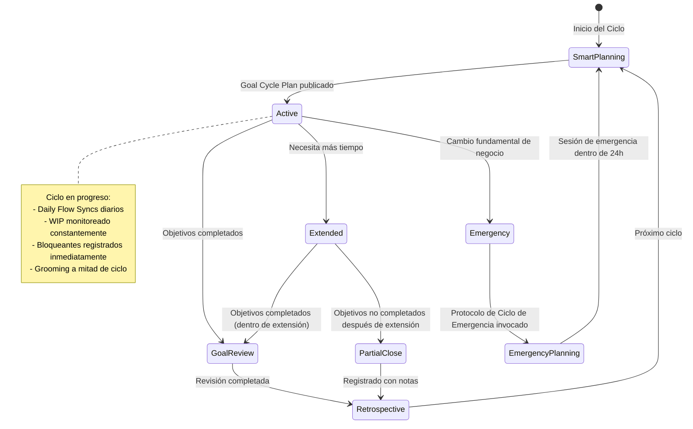
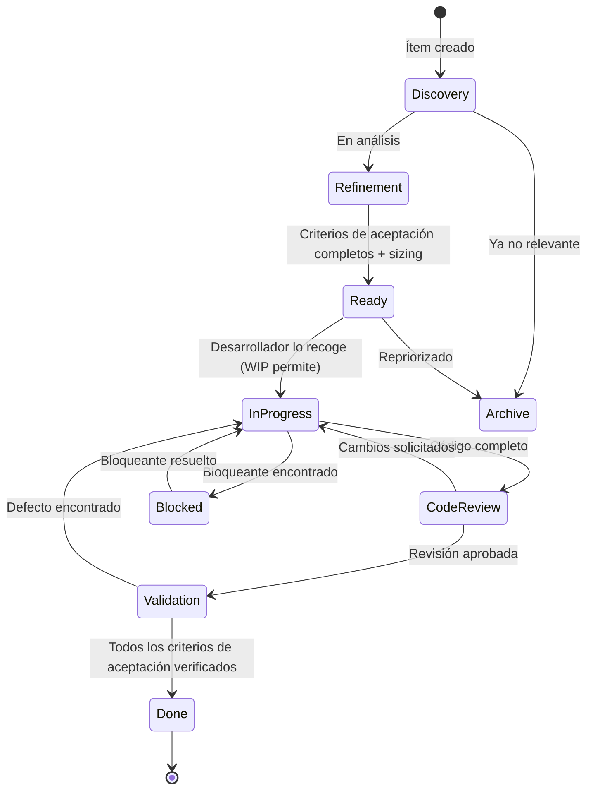
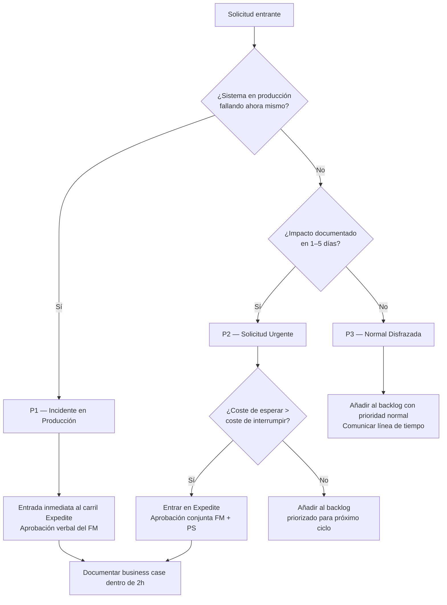
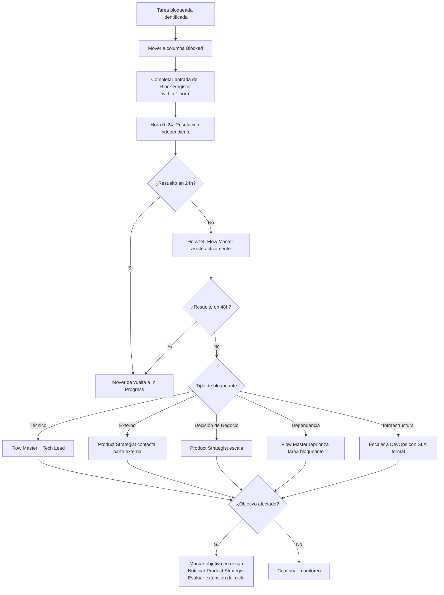
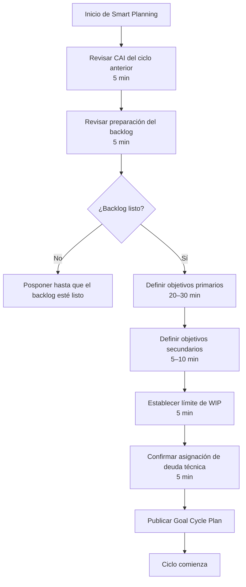
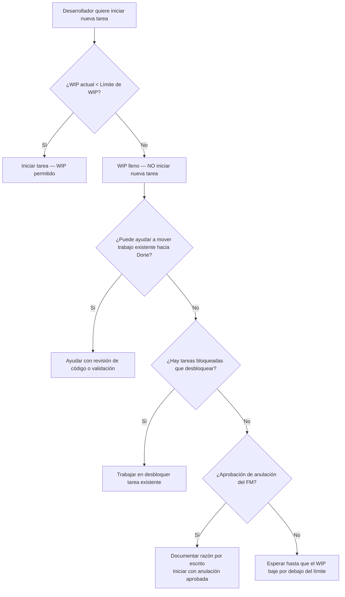

# Diagramas de Flujo de Trabajo

Diagramas visuales de los procesos clave del framework GOAL.

---

## Ciclo de Vida del Ciclo de Objetivos

---

## Máquina de Estados de Tarea

---

## Protocolo de Gestión de Interrupciones

---

## Escalación de Tareas Bloqueadas

---

## Smart Planning Session

---

## Aplicación de Límites de WIP

---

*Metodología GOAL Agile v0.2 | Autor: Felipe Montenegro*
